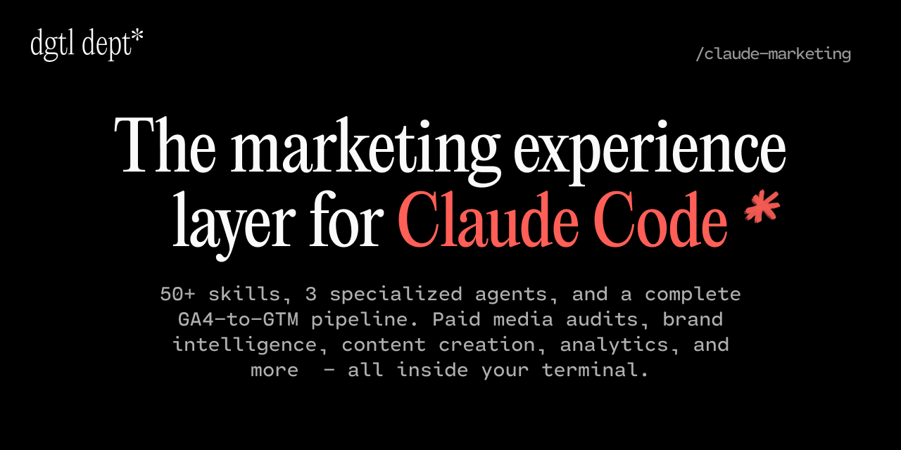

<div align="center">



<br>
<br>

**claude-marketing contains 56 open-source Claude Code skills, specialized agents, and autonomous workflows for marketing teams.** Paid media, e-commerce, content, strategy, creative, reporting, and development — specialist depth without specialist headcount.

<br>
<br>

[](https://docs.anthropic.com/en/docs/claude-code)
[](https://linkedin.com/in/rebeccaraebarton)
[](https://x.com/rebeccarae)
[](https://dgtldept.substack.com/welcome)
[](https://rebeccaraebarton.com)
[](https://github.com/thatrebeccarae/claude-marketing/stargazers)
[](LICENSE)
[](https://github.com/thatrebeccarae/claude-marketing)

<br>

```bash
git clone https://github.com/thatrebeccarae/claude-marketing.git
```

<br>

**Works on Mac, Windows, and Linux.**

<br>
<br>

[Quick Start](#quick-start) · [Skills](#skills) · [Skill Packs](#skill-packs) · [Agents](#agents) · [Workflows](#workflows) · [Multi-Tool Support](#multi-tool-support) · [How Skills Work](#how-skills-work) · [Composing Skills](#composing-skills) · [Example Prompts](#example-prompts) · [Configuration](#configuration) · [Contributing](#contributing) · [License](#license)


</div>

---

56 open-source skills that give [Claude Code](https://docs.anthropic.com/en/docs/claude-code) real marketing expertise — diagnostic frameworks, industry benchmarks, audit checklists, and platform-specific reference data across paid media, SEO, e-commerce, content, CRO, analytics, and strategy. Also works with Cursor, Aider, Windsurf, GitHub Copilot, and Gemini CLI.

Each skill ships three layers: **SKILL.md** (frameworks and decision trees), **REFERENCE.md** (benchmarks, API schemas, rate limits), and **EXAMPLES.md** (worked prompts with expected output). Not prompt templates — implementation-grade tools tested in real engagements.

The catalog came out of [a client engagement where the team was drowning in meetings](https://dgtldept.substack.com/p/the-marketing-expertise-layer-for-claude-code) and grew from there. The companion essay on dgtl dept\* walks through three of the skills with the exact prompts I run on live engagements, the output they return, and what they replace.

For installing and using them properly, the [**Claude Marketing — The Complete Guide**](https://thatrebeccarae.kit.com/claude-marketing-guide) is the deeper reference — free, in Notion, six pages on install, credentials, the six skills to start with, how the scored audits work, five workflow chains I run on engagements, and the n8n pipeline build. Read it before you start, or keep it open on a second monitor while you work.

<div align="center">

[](https://thatrebeccarae.kit.com/claude-marketing-guide)

</div>

## Quick Start

```bash
# Clone the repo
git clone https://github.com/thatrebeccarae/claude-marketing.git

# Copy any skill
cp -r claude-marketing/skills/google-ads ~/.claude/skills/

# Or install a full pack
python claude-marketing/skill-packs/scripts/setup-paid-media.py

# Then ask Claude Code anything
# "Run a scored audit of my Google Ads account"
# "Audit my Klaviyo flows and tell me what's missing"
# "Optimize this page for AI search citations"
```

Each skill works independently — install only what you need.

## What's Inside

| Category | What It Is | Count |
|----------|-----------|-------|
| **[Skills](skills/)** | Claude Code skills — install individually or as packs | 56 skills |
| **[Skill Packs](skill-packs/)** | Grouped collections with setup guides and install wizards | 6 packs |
| **[Examples](examples/)** | Cross-skill workflow walkthroughs showing how skills compose | 3 workflows |
| **[Agents](agents/)** | Standalone agents — portable analysis logic, usable with or without n8n | 3 agents |
| **[Workflows](workflows/)** | Autonomous n8n pipelines that wire agents together on a schedule | 1 pipeline |

## Skills

All 56 skills live in [`skills/`](skills/) — install individually or use a [skill pack](skill-packs/) to set up a related group. The interactive demo site has search, skill details, and install instructions for each.

> **All skills tested March 2026 with Claude Code v2.1.** Each skill's SKILL.md includes a `tested` date and `tested_with` version in its frontmatter metadata.

<div align="center">

[](https://thatrebeccarae.github.io/claude-marketing/)

</div>

### Paid Media

| Skill | What Claude Can Do |
|-------|-------------------|
| **[Google Ads](skills/google-ads/)** | Scored account audits (74 checks, A-F health grade), Quality Score optimization, Performance Max, Shopping, bidding strategies, wasted spend identification |
| **[Meta Ads](skills/facebook-ads/)** | Scored account audits (46 checks, A-F health grade), creative fatigue diagnosis, pixel/CAPI health, iOS 14.5+ attribution, Advantage+ readiness |
| **[Microsoft Ads](skills/microsoft-ads/)** | Scored account audits (30 checks, A-F health grade), Google import optimization, LinkedIn Profile Targeting, UET tracking, Clarity integration |
| **[LinkedIn Ads](skills/linkedin-ads/)** | B2B advertising — campaign setup, professional targeting, Lead Gen Forms, ABM campaigns, Matched Audiences |
| **[TikTok Ads](skills/tiktok-ads/)** | Short-form video ads — Spark Ads, TikTok Shop, creative strategy, pixel/Events API, audience targeting |
| **[Cross-Platform Audit](skills/cross-platform-audit/)** | Unified multi-platform scored audit — parallel execution across Google, Meta, and Microsoft with budget-weighted aggregate health score (A-F) |
| **[Account Structure Review](skills/account-structure-review/)** | Cross-platform structural audit — conversion volume thresholds, budget fragmentation, consolidation roadmaps |
| **[Competitor Ads Analyst](skills/competitor-ads-analyst/)** | Competitor ad creative analysis from public ad libraries — messaging patterns, creative formats, positioning gaps |
| **[Wasted Spend Finder](skills/wasted-spend-finder/)** | Systematic Google Ads and Meta waste analysis — produces uploadable exclusion lists with thematic categorization |

### SEO & AI Search

| Skill | What Claude Can Do |
|-------|-------------------|
| **[AEO/GEO Optimizer](skills/aeo-geo-optimizer/)** | AI search optimization — appear in ChatGPT, Perplexity, Google AI Overviews. Content scoring, citation patterns, AI crawler management |
| **[Technical SEO Audit](skills/technical-seo-audit/)** | Deep crawl analysis, Core Web Vitals, indexation health, site architecture, canonical tags, structured data validation |
| **[Schema Markup Generator](skills/schema-markup-generator/)** | JSON-LD structured data — Article, FAQ, HowTo, Product, Review, LocalBusiness, BreadcrumbList |
| **[Programmatic SEO](skills/programmatic-seo/)** | Template-based page generation at scale — integration pages, location pages, comparison pages, internal linking |
| **[SEO Content Writer](skills/seo-content-writer/)** | SEO-optimized content with brand voice analysis — blog posts, social media, email campaigns, landing pages |
| **[llms.txt](skills/llms-txt/)** | Generate llms.txt files for AI discoverability — helps answer engines surface your project accurately |

### Content

| Skill | What Claude Can Do |
|-------|-------------------|
| **[Content Creator](skills/content-creator/)** | Brand voice analysis, SEO optimization scripts, content calendar planning, multi-platform strategy |
| **[Copywriting Frameworks](skills/copywriting-frameworks/)** | AIDA, PAS, BAB, 4Ps, StoryBrand, QUEST, FAB — framework-driven copy for ads, pages, emails |
| **[Social Media Strategy](skills/social-media-strategy/)** | Platform-specific organic strategy, content pillar framework, engagement tactics, content calendars |
| **[Email Composer](skills/email-composer/)** | Client outreach, deliverable handoffs, scope discussions, and follow-up cadence — with tone calibration per context |
| **[Content Pipeline](skills/content-pipeline/)** | Multi-agent orchestration — chains research, editorial review, and social distribution agents in sequence |
| **[Content Workflow](skills/content-workflow/)** | End-to-end content pipeline: research → draft → editorial review → social distribution |

### Growth & Conversion

| Skill | What Claude Can Do |
|-------|-------------------|
| **[CRO Auditor](skills/cro-auditor/)** | Conversion rate optimization — LIFT model heuristic evaluation, ICE/PIE prioritization, A/B test hypothesis generation |
| **[Landing Page Optimizer](skills/landing-page-optimizer/)** | Page audit and optimization — above-the-fold, value props, CTAs, social proof, forms, mobile |
| **[A/B Testing Framework](skills/ab-testing-framework/)** | Experiment design, sample size calculation, statistical significance, Bayesian vs frequentist analysis |
| **[Retention & Churn Prevention](skills/retention-churn-prevention/)** | Churn analysis, customer health scoring, cohort analysis, win-back campaigns, CLV calculation |

### Strategy & Research

| Skill | What Claude Can Do |
|-------|-------------------|
| **[Brand DNA](skills/brand-dna/)** | Extract brand identity from a URL — voice, colors, typography, imagery, values, audience — into brand-profile.json for downstream skill consumption |
| **[Brand Voice & Guidelines](skills/brand-voice-guidelines/)** | Voice development, personality archetypes, tone matrices, messaging frameworks, style guides |
| **[Market Research](skills/market-research/)** | Consulting-grade research reports (50+ pages) — Porter's Five Forces, PESTLE, SWOT, TAM/SAM/SOM, competitive positioning |
| **[ICP Research](skills/icp-research/)** | Ideal customer profiles with pain points, objections, buying triggers, community research, and voice-of-customer extraction |
| **[Customer Journey Mapping](skills/customer-journey-mapping/)** | Journey stage mapping, touchpoint inventory, drop-off analysis, persona-based journey variants |
| **[Pricing Strategy](skills/pricing-strategy/)** | Pricing models, value metric selection, competitive analysis, pricing page optimization, tier design |
| **[Research Digest](skills/research-digest/)** | Structured research briefs from RSS feeds and web sources — source synthesis, credibility assessment, content angles |
| **[Cold Email & Outreach](skills/cold-email-outreach/)** | Outbound prospecting sequences, deliverability optimization, personalization tiers, CAN-SPAM/GDPR compliance |

### Email & Lifecycle

| Skill | What Claude Can Do |
|-------|-------------------|
| **[Klaviyo Analyst](skills/klaviyo-analyst/)** *(MCP-first)* | Full Klaviyo audit — 4-phase account review, flow gap analysis, segment health, deliverability diagnostics, revenue attribution with industry benchmarks. Built around the official Klaviyo MCP server. |
| **[Klaviyo Developer](skills/klaviyo-developer/)** | Event schema design, SDK integration, webhook handling, rate limit strategy, catalog sync. MCP-aware for exploration; SDK-first for production integrations. |
| **[Braze](skills/braze/)** | Canvas audit, segmentation, cross-channel orchestration, data architecture, deliverability, IP warming |

### Analytics

| Skill | What Claude Can Do |
|-------|-------------------|
| **[Google Analytics](skills/google-analytics/)** | GA4 traffic analysis, channel comparison, conversion funnels, content performance |
| **[Google Tag Manager](skills/google-tag-manager/)** | Container audits, consent mode v2, server-side tagging, debugging, tag architecture |
| **[Looker Studio](skills/looker-studio/)** | Cross-platform dashboards via Google Sheets pipeline, DTC dashboard templates, calculated field library |
| **[Shopify](skills/shopify/)** | 12-step store audit, conversion funnel analysis, site speed diagnostics, marketing stack integration |
| **[UTM & Attribution Strategy](skills/utm-attribution-strategy/)** | UTM taxonomy design, attribution model selection, cross-channel measurement, GA4 attribution configuration |

### Creative & Design

| Skill | What Claude Can Do |
|-------|-------------------|
| **[Frontend Design](skills/frontend-design/)** | Distinctive, production-grade web interfaces — typography, color theory, motion, spatial composition. Commits to a specific aesthetic direction, not generic defaults. |
| **[Tech Diagram](skills/tech-diagram/)** | Technical architecture diagrams as standalone HTML — pipeline flows, layer stacks, component maps, timelines |
| **[Remotion Video](skills/remotion-video/)** | Programmatic video production — spring animations, chart animations, scene transitions, audio sync |

### Reporting & Deliverables

| Skill | What Claude Can Do |
|-------|-------------------|
| **[Pro Deck Builder](skills/pro-deck-builder/)** | Polished HTML slide decks and PDF-ready reports — dark covers, warm light content, component library |
| **[Pro Report Builder](skills/pro-report-builder/)** | HTML consulting reports — dark cover, warm cream pages, KPI cards, data tables, recommendation cards, PDF export |
| **[HTML Report Builder](skills/html-report-builder/)** | Multi-page HTML reports for consulting deliverables — KPI cards, data tables, callout boxes, recommendation cards |
| **[Data Viz Deck](skills/data-viz-deck/)** | PPTX decks, interactive HTML dashboards, and chart generation from audit data |

### DevOps

| Skill | What Claude Can Do |
|-------|-------------------|
| **[GitHub README](skills/github-readme/)** | Project-type-aware README generation, audit (scored 0-100), and update — with voice calibration and SEO/AEO discoverability guidance |
| **[Repo Health](skills/repo-health/)** | One-command repo health audit — checks standard files, GitHub config, branch protection, documentation quality |
| **[Repo Scaffold](skills/repo-scaffold/)** | Initialize repos with standard files — LICENSE, CONTRIBUTING, SECURITY, issue/PR templates, CI config |
| **[Sync Repos](skills/sync-repos/)** | Manage public/private repo pairs — verify parity, detect drift, run sync scripts, validate no data leaks |
| **[Dep Audit](skills/dep-audit/)** | Cross-repo dependency audit — outdated packages, security advisories, version conflicts, license issues |
| **[Release Notes](skills/release-notes/)** | Generate changelogs and GitHub releases from git history — conventional commits, PR grouping, semver |
| **[Social Preview](skills/social-preview/)** | Generate OG social preview images (1280x640) for GitHub repos — branded templates, dark/light themes |
| **[Safe Push](skills/safe-push/)** | Pre-push hygiene — PII/secrets scanning, commit message audit, rate-limited pushing, allowlist support |

## Skill Packs

Grouped collections with setup wizards for installing related skills together:

<!-- PACK-LIST-START -->
- **[Content Pack](skill-packs/content-pack.md)** — 3 skills for SEO content, editorial pipelines, and client communication. (seo-content-writer, content-workflow, email-composer)
- **[Creative & Design Pack](skill-packs/creative-pack.md)** — 3 skills for frontend interfaces, technical diagrams, and programmatic video. (frontend-design, tech-diagram, remotion-video)
- **[Developer Tools Pack](skill-packs/dev-tools-pack.md)** — 2 skills for pre-push security scanning and README generation. (safe-push, github-readme)
- **[DTC Skill Pack](skill-packs/dtc-pack.md)** — 6 skills that give Claude Code deep expertise in DTC e-commerce marketing. (klaviyo-analyst, klaviyo-developer, shopify, google-analytics, looker-studio, pro-deck-builder)
- **[Paid Media Pack](skill-packs/paid-media-pack.md)** — 6 skills for cross-platform paid media — Google Ads, Meta Ads, Microsoft Ads, competitive analysis, waste detection, and account structure review. (google-ads, facebook-ads, microsoft-ads, competitor-ads-analyst, wasted-spend-finder, account-structure-review)
- **[Strategy & Research Pack](skill-packs/strategy-pack.md)** — 3 skills for market research, ICP development, and research synthesis. (market-research, icp-research, research-digest)
<!-- PACK-LIST-END -->

## Multi-Tool Support

Skills work with 5 AI coding tools beyond Claude Code — Cursor, Aider, Windsurf, GitHub Copilot, and Gemini CLI. Run `install.sh` for interactive setup, or follow the per-tool instructions below.

### Quick Install

```bash
bash scripts/install.sh
```

Auto-detects your installed tools, lets you choose which to install for.

### Per-Tool Quick-Start

**Cursor** — One rule file per skill, auto-suggested by Cursor agent.

```bash
cp integrations/cursor/*.mdc your-project/.cursor/rules/
```

**Aider** — Skills load every session via config.

```bash
cp integrations/aider/CONVENTIONS.md your-project/
echo "read: CONVENTIONS.md" >> your-project/.aider.conf.yml
```

**Windsurf** — All skills in one file, always active.

```bash
cp integrations/windsurf/.windsurfrules your-project/
```

**GitHub Copilot** — Works in VS Code and on GitHub.com.

```bash
cp integrations/copilot/*.instructions.md your-project/.github/instructions/
```

**Gemini CLI** — Modular loading via `@import`.

```bash
cp -r integrations/gemini/* your-project/
```

### Compatibility Matrix

Not all skill content translates across formats — some tools have size limits or don't support file references.

| Content | Claude Code | Cursor | Aider | Windsurf | Copilot | Gemini CLI |
|---------|:-----------:|:------:|:-----:|:--------:|:-------:|:----------:|
| Core capabilities | Full | Full | Summary | Summary | Full | Full |
| Reference data | Full | Partial | — | — | — | Full (@import) |
| Examples | Full | — | — | — | — | Optional |
| Install command | Full | — | — | — | — | — |

### Advanced Usage

To regenerate `integrations/` after editing skills:

```bash
bash scripts/convert.sh
```

See [CONTRIBUTING.md](CONTRIBUTING.md) for adding new skills and keeping converted output in sync.

## How Skills Work

A Claude Code skill is a structured domain expertise file that loads into Claude automatically when invoked. Each skill contains diagnostic frameworks, industry benchmarks, and platform-specific reference data that Claude doesn't have out of the box — the kind of context that turns a general-purpose AI into a specialist.

#### What a Skill Contains

| File | Purpose |
|------|---------|
| **SKILL.md** | Frontmatter + instructions Claude reads at invocation — frameworks, decision trees, diagnostic patterns |
| **REFERENCE.md** | Platform-specific data: industry benchmarks, API schemas, field mappings, rate limits |
| **EXAMPLES.md** | Working examples with realistic prompts and expected output format |
| **scripts/** | Utility scripts for setup, data fetching, health checks (where applicable) |

#### How Claude Uses Them

1. You ask a question in natural language (e.g., *"Audit my Klaviyo flows"*)
2. Claude loads the relevant skill's SKILL.md, which contains the diagnostic framework
3. Claude references REFERENCE.md for benchmarks, thresholds, and platform-specific data
4. If an MCP server is configured (e.g., Klaviyo), Claude pulls live data from your account
5. Claude delivers structured analysis with specific recommendations — not generic advice

> [!NOTE]
> Skills work without MCP servers too. You can paste data, share screenshots, or use the included scripts to export data manually. The MCP server just makes it seamless.

### Agents and Workflows

Agents are standalone analysis modules with portable logic — comparison engines, prompt builders, response parsers. Each agent works independently and can be used without n8n.

Workflows are autonomous n8n pipelines that wire agents together on a schedule. n8n runs locally here to save on costs, but cloud hosting works too. Unlike skills (which respond when you ask), workflows run on a schedule and act independently.

Workflows use Claude via the Anthropic API (not Claude Code) — Claude Opus 4.6 with adaptive thinking for deep analysis, Claude Haiku 4.5 for fast classification.

## Agents

Standalone agents with portable analysis logic — usable independently or wired together by a workflow.

| Agent | What It Does |
|-------|-------------|
| **[GA4 Monitor](agents/ga4-monitor/)** | Compares GA4 event data against a tracking spec, flags gaps, unexpected events, and volume anomalies |
| **[GA4 Gap Analyzer](agents/ga4-gap-analyzer/)** | Claude diagnoses tracking gaps (Opus 4.6 + adaptive thinking) and anomalies (Haiku 4.5), generates GTM implementation specs. Optional AEO awareness recommends an `ai_referral` event when client config sets `aeo_tracking_enabled: true`. |
| **[GTM Implementer](agents/gtm-implementer/)** | Creates GTM variables, triggers, and tags — rate-limited, idempotent, workspace-isolated |

Each agent works independently. Use GA4 Monitor for one-time audits without Claude or GTM. Use GA4 Gap Analyzer to diagnose issues from any comparison data. Use GTM Implementer to provision resources from any spec.

## Workflows

Autonomous n8n pipelines that wire agents together on a schedule. They monitor, analyze, and act — then notify you with results.

### [GA4-GTM Pipeline](workflows/ga4-gtm-pipeline/) — Daily GA4 monitoring + GTM implementation

GA4 tracking gaps cost you conversion data every day. This pipeline detects them automatically and patches them in GTM.

| Stage | Agent | What Happens |
|-------|-------|-------------|
| **Monitor** | [GA4 Monitor](agents/ga4-monitor/) | Fetches all GA4 events daily, compares against your event spec |
| **Analyze** | [GA4 Gap Analyzer](agents/ga4-gap-analyzer/) | Claude Opus (with adaptive thinking) identifies gaps and recommends GTM implementations; Claude Haiku diagnoses anomalies |
| **Implement** | [GTM Implementer](agents/gtm-implementer/) | Creates GTM variables, triggers, and tags in an isolated workspace (unpublished until you review) |
| **Notify** | — | Slack messages at every stage — all-clear, gaps found, anomalies detected, GTM resources created |

Handles multiple GA4 properties — configure once per property, runs hands-off from there.

See the [GA4-GTM Pipeline README](workflows/ga4-gtm-pipeline/README.md) for the architecture overview, or the [Complete Guide](https://thatrebeccarae.kit.com/claude-marketing-guide) for the full n8n build walkthrough.

## Composing Skills

Skills are most powerful when chained together — each skill's output becomes context for the next. See the [full composing guide](examples/) for how context flows between skills.

| Workflow | Skills Chained | What You Get |
|----------|---------------|--------------|
| **[DTC Account Audit](examples/dtc-account-audit.md)** | ICP Research → Klaviyo Analyst → Google Analytics → Pro Deck Builder | Client-ready audit deck in ~45 min |
| **[Paid Media Optimization](examples/paid-media-optimization.md)** | Wasted Spend Finder → Competitor Ads Analyst → Google Ads → Account Structure Review | Exclusion lists + restructuring roadmap |
| **[Content Production](examples/content-production.md)** | Research Digest → ICP Research → SEO Content Writer → Content Workflow | SEO article + social distribution pack |

## Example Prompts

### Email & Lifecycle
```
"Audit my Klaviyo flows and identify which essential flows I'm missing"
"My checkout completion rate is 31% — what's causing the drop-off?"
"Which traffic sources are driving the most conversions this month?"
```

### Paid Media
```
"Analyze my Google Ads search terms and find wasted spend"
"Pull competitor ads from Meta Ad Library for these 3 brands and find messaging gaps"
"Run a full cross-platform audit across Google, Meta, and Microsoft — give me a unified health score and deck"
```

### Content & Strategy
```
"Build an ICP for our SaaS product targeting VP of Marketing at mid-market companies"
"Write a 1,500-word SEO article targeting 'email marketing benchmarks for DTC brands'"
"Generate a research brief on AI in email marketing from the last 30 days"
```

### Creative & Reporting
```
"Create a dark-mode deck summarizing this month's email performance"
"Build an HTML audit report from these Klaviyo metrics"
"Design a landing page for our analytics product — editorial aesthetic, not typical SaaS"
```

### Developer Tools
```
"Audit this repo's README and score it"
"Run a health check across all my public repos"
"Scaffold a new repo with standard files and CI config"
"Generate release notes from the last 20 commits"
"Check for outdated dependencies across all my Node projects"
```

## Configuration

### Setup Wizard Options

| Flag | What It Does |
|------|-------------|
| `python scripts/setup.py` | Full interactive setup |
| `--skip-install` | Skip dependency installation |
| `--skills klaviyo,shopify` | Install specific skills only |
| `--non-interactive` | Use environment variables, skip prompts |

### API Keys by Platform

| Platform | Key Required | Where to Get It |
|----------|-------------|-----------------|
| **Klaviyo** | Private API Key (`pk_...`) | Klaviyo > Settings > API Keys |
| **Google Analytics** | Service account JSON + Property ID | Google Cloud Console > IAM > Service Accounts |
| **Shopify** | Admin API access token | Shopify Admin > Apps > Develop Apps |
| **Looker Studio** | Google Sheets API credentials | Google Cloud Console > APIs & Services |

> [!IMPORTANT]
> API keys are stored in `.env` files which are gitignored by default. Never hardcode keys in skill files or commit them to version control. See [SECURITY.md](SECURITY.md) for full credential handling guidance.

<details>
<summary><strong>Klaviyo MCP server setup</strong></summary>

The [official Klaviyo MCP server](https://developers.klaviyo.com/en/docs/klaviyo_mcp_server) gives Claude direct access to your Klaviyo account. The setup path depends on which Claude surface you're using.

**Option A — Claude Chat or Cowork (Connector Directory, ~2 min)**

Klaviyo is in Claude's Connector Directory as of the expanded Klaviyo + Anthropic integration ([announced 2026-05-07](https://www.klaviyo.com/blog/agentic-marketing-workflows-with-klaviyo-anthropic-claude)). Setup is:

1. Open Claude → **Settings → Connectors → Browse Connectors**
2. Search for **Klaviyo**
3. Click **Connect** and authenticate

Available on Claude **Pro, Max, Team, and Enterprise** plans. Free plan users need to use Claude Code or the local install path below.

**Option B — Claude Code (remote MCP)**

```bash
claude mcp add klaviyo --transport http https://mcp.klaviyo.com/mcp
```

For audit-only sessions:

```bash
claude mcp add klaviyo --transport http "https://mcp.klaviyo.com/mcp?read-only=true"
```

**Option C — Local MCP via uvx (CI containers, offline development)**

1. Install uv: `curl -LsSf https://astral.sh/uv/install.sh | sh`
2. Add to `~/.mcp.json`:

```json
{
  "mcpServers": {
    "klaviyo": {
      "command": "uvx",
      "args": ["klaviyo-mcp-server@latest"],
      "env": {
        "PRIVATE_API_KEY": "${KLAVIYO_API_KEY}",
        "READ_ONLY": "true",
        "ALLOW_USER_GENERATED_CONTENT": "false"
      }
    }
  }
}
```

3. Restart Claude Code and verify with `/mcp`

**Klaviyo-side requirement:** Owner, Admin, or Manager role to authorize the connection (any option above).

All three options expose the same 40+ tools across Accounts, Campaigns, Catalogs, Events, Flows, Groups, Profiles, Reporting, Templates, and Translations. See the [klaviyo-analyst REFERENCE](skills/klaviyo-analyst/REFERENCE.md#mcp-server-reference) for the full tool inventory. See the [DTC Pack guide](skill-packs/dtc-pack.md) for recommended Klaviyo API scopes when using the local option.

</details>

## Security

All scripts include input validation, path sanitization, SSRF protection, and secure credential handling. Key principles:

- **API keys** stored in `.env` files (gitignored), never hardcoded
- **Read-only API access** by default — write scopes are opt-in
- **No PII extraction** — skills work with aggregates, not individual customer data
- **No persistent storage** — analysis runs in-memory, output goes to local files you control

For vulnerability reporting and full security design details, see [SECURITY.md](SECURITY.md).

## Troubleshooting

<details>
<summary><strong>Skills not loading in Claude Code</strong></summary>

1. Verify skills are in the right directory: `ls ~/.claude/skills/`
2. Each skill folder should contain at least a `SKILL.md` file
3. Restart Claude Code after copying skills
4. Check that SKILL.md frontmatter is valid YAML

</details>

<details>
<summary><strong>API key errors</strong></summary>

1. Confirm your `.env` file is in the project root (not inside a skill folder)
2. Klaviyo keys must start with `pk_` — if yours doesn't, you may have copied a public key
3. Google service account JSON path must be absolute, not relative
4. Run `python scripts/setup.py` to re-validate all keys

</details>

<details>
<summary><strong>Python version issues</strong></summary>

The setup wizard requires Python 3.8+. Check your version:

```bash
python --version
# or
python3 --version
```

On macOS, `python` may point to Python 2. Use `python3` explicitly or install via Homebrew: `brew install python`

</details>

<details>
<summary><strong>MCP server not connecting</strong></summary>

1. Verify `~/.mcp.json` syntax is valid JSON (no trailing commas)
2. Confirm `uv` is installed: `uv --version`
3. Check that your `KLAVIYO_API_KEY` environment variable is set: `echo $KLAVIYO_API_KEY`
4. Restart Claude Code — MCP servers load at startup

</details>

## Documentation

### Skill Packs

<!-- PACK-DOCS-START -->
| Pack | Skills | Description |
|------|--------|-------------|
| [Content Pack](skill-packs/content-pack.md) | 3 | 3 skills for SEO content, editorial pipelines, and client communication. |
| [Creative & Design Pack](skill-packs/creative-pack.md) | 3 | 3 skills for frontend interfaces, technical diagrams, and programmatic video. |
| [Developer Tools Pack](skill-packs/dev-tools-pack.md) | 2 | 2 skills for pre-push security scanning and README generation. |
| [DTC Skill Pack](skill-packs/dtc-pack.md) | 6 | 6 skills that give Claude Code deep expertise in DTC e-commerce marketing. |
| [Paid Media Pack](skill-packs/paid-media-pack.md) | 6 | 6 skills for cross-platform paid media — Google Ads, Meta Ads, Microsoft Ads, competitive analysis, waste detection, and account structure review. |
| [Strategy & Research Pack](skill-packs/strategy-pack.md) | 3 | 3 skills for market research, ICP development, and research synthesis. |
<!-- PACK-DOCS-END -->

### Other Resources

| Resource | Description |
|----------|-------------|
| [The Marketing Expertise Layer for Claude Code](https://dgtldept.substack.com/p/the-marketing-expertise-layer-for-claude-code) | Companion essay on dgtl dept* — three skills walked end-to-end with the prompts I actually type |
| [Claude Marketing — The Complete Guide](https://thatrebeccarae.kit.com/claude-marketing-guide) | Free Notion reference. Six pages: install, credentials, six skills to start with, scored audits explained, five workflow chains, the n8n pipeline build, troubleshooting |
| [Composing Skills](examples/) | How to chain skills together — context flow, tips, and 3 worked workflow examples |
| [DTC Getting Started](skill-packs/dtc-getting-started.md) | Step-by-step setup for DTC platforms |
| [Paid Media Getting Started](skill-packs/paid-media-getting-started.md) | Step-by-step setup for paid media platforms |
| [GA4-GTM Pipeline README](workflows/ga4-gtm-pipeline/README.md) | Pipeline architecture, agent orchestration, setup, and security model |
| [CHANGELOG](CHANGELOG.md) | Version history and release notes |
| [SECURITY](SECURITY.md) | Security design and vulnerability reporting |
| [CONTRIBUTING](CONTRIBUTING.md) | How to contribute skills, report bugs, submit PRs |

## Contributing

Contributions are welcome — bug reports, documentation fixes, skill suggestions, and new skills. See [CONTRIBUTING.md](CONTRIBUTING.md) for guidelines on submitting skills, the required file structure, and the PR process.

## License

MIT — see [LICENSE](LICENSE) for details.

<div align="center">

---

**The expertise layer your AI agent is missing.**<br>git clone it. Install what you need. Ask in plain English.

<br>
<br>

_Please don't be a jerk and steal my work._

</div>
